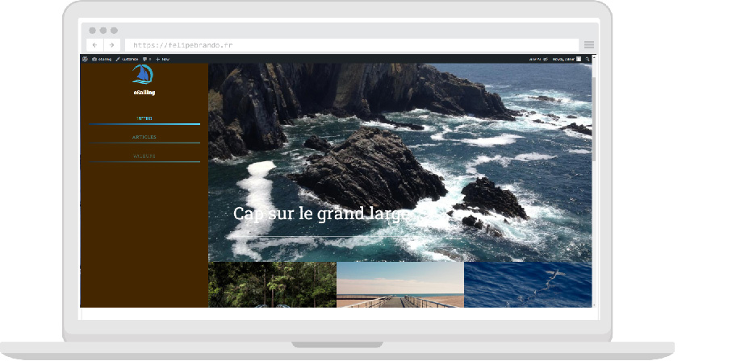

# WordPress Custom Theme
**WordPress Custom Theme** made from a HTML/CSS integration

## Tasks done :
* WordPress intall fro command line
* Create Required Files / Folders for Theme
* Activating the New Theme
* Create Theme Home Page Template
* Add Dynamic content
* Create Theme Articles Template
* Dynamic Menu 
* Customizers configuration to change the main image and color theme
